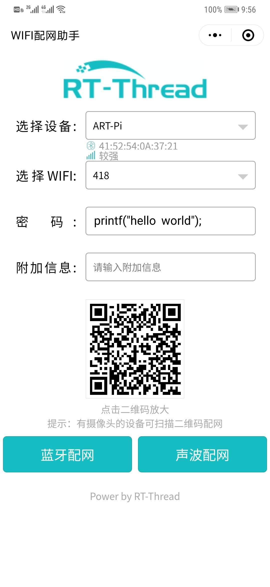
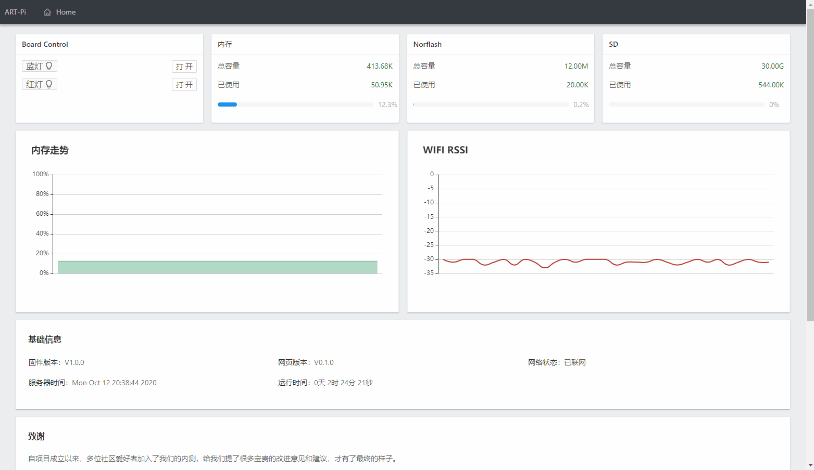

# 出厂例程

## 简介
本例程为出厂例程，可通过蓝牙对开发板进行配网，内置一个web服务器，配网成功后能够通过网页显示开发板的基本信息，并对开发板的板载LED进行简单的控制。

## 硬件说明

  AP6212是正基AMPAK推出的一款低功耗高性能的WiFi+BT4.2模块，该模块符合802.11b/g/n，其中WiFi功能采用SDIO接口，蓝牙采用UART/I2S/PCM接口，具有StationMode，SoftAP，P2P功能等。该芯片硬件电路连接方式如图所示。

## 软件说明
本例程应用层代码分为了几个模块：基础信息模块，蓝牙模块，json字符串封包模块，系统监测模块，web服务器模块以及wifi模块。源码位于 `/projects/art_pi_factory/modules/`目录下。分别为`basic`,`bt_module`,`json_common`,`monitor`,`web`和`wifi`。

- 基础信息模块主要用于为网页发出的请求收集数据并且封装成json字符串并回送到网页端，是网页信息显示的基础。
- 蓝牙模块用于为蓝牙的运行创造环境，包括检测验证蓝牙固件的完整性以及蓝牙的初始化。
- json字符串封包模块主要用于封装通用的网页响应字符串。
- 系统监测模块用于运行一些系统的应用，如系统运行时间的计算以及定时的NTP校时。
- web服务器模块用于初始化webnet应用。
- wifi模块用于初始化wifi，并且提供一些wifi信息的获取接口。

## 运行
### 编译&下载

编译完成后，将开发板的 ST-Link USB 口与 PC 机连接，然后将固件下载至开发板。

出厂默认刷好了wifi和蓝牙固件和网页文件，若固件丢失，可以按照以下方法重新传入。

#### WIFI以及蓝牙固件

wifi和蓝牙固件的上传方式相同，可以通过终端进行ymodem传输。固件路径位于`/tools/firmware/`目录下。其中`ap6212-bt-image-1.0.rbl`为蓝牙固件，`ap6212-wifi-image-1.0.rbl`为WIFI固件。以WIFI固件上传为例，需要执行两个步骤：
1. 在终端命令行中输入`update`命令。
2. 使用ymodem进行文件传输。

完成后系统会自动识别传入的固件，若固件有效则会自动搬运到对应的固件存储区。

#### 网页文件

网页文件存在于`/projects/art_pi_factory/applications/web_dist`目录下，不同于WIFI及蓝牙固件的上传，网页文件需要联网后通过 **adb** 工具进行上传,需要将`webnet`目录上传到开发板的`/flash/目录下`。具体的使用方法如下：
[ADB 使用说明](https://github.com/heyuanjie87/adbd#readme)

### 运行效果

**出厂例程的正常运行需要蓝牙固件，WIFI固件以及网页文件的支持，如果开发板缺少这些文件，则需要按照上文的教程进行文件的上传。**

开发板上电后需要蓝牙配网，打开微信**WIFI配网助手**小程序，设备选择**ART-Pi**，选择所要连接的WIFI SSID和密码，输入完成后点击**蓝牙配网**按钮进行配网。

配网成功后小程序会跳出成功页面，并且显示开发板获取到的IP地址。

此时点击 **一键复制** 将IP地址复制到剪切板并复制到浏览器中即可打开开发板主页。

## 注意事项

开发板主页依赖于外网资源，请确保开发板连接的无线网能够接入互联网。

