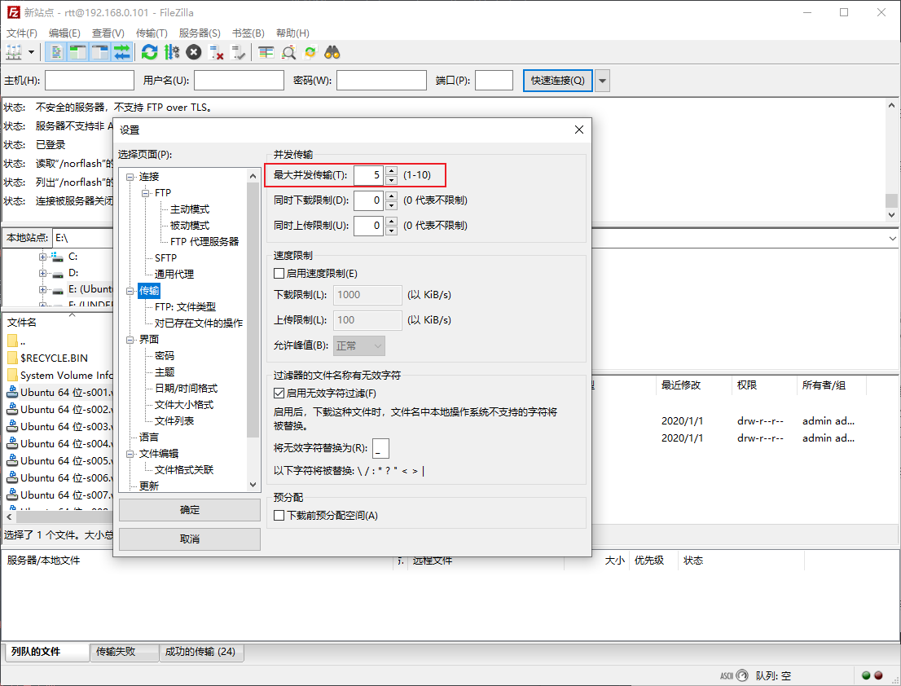
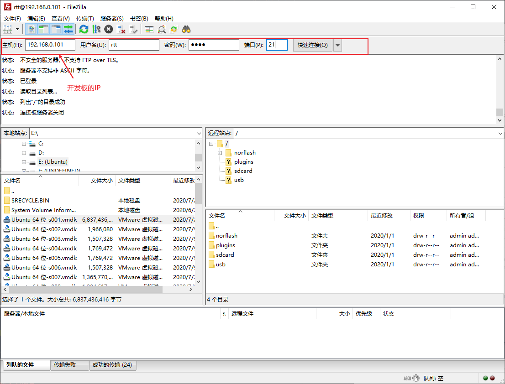
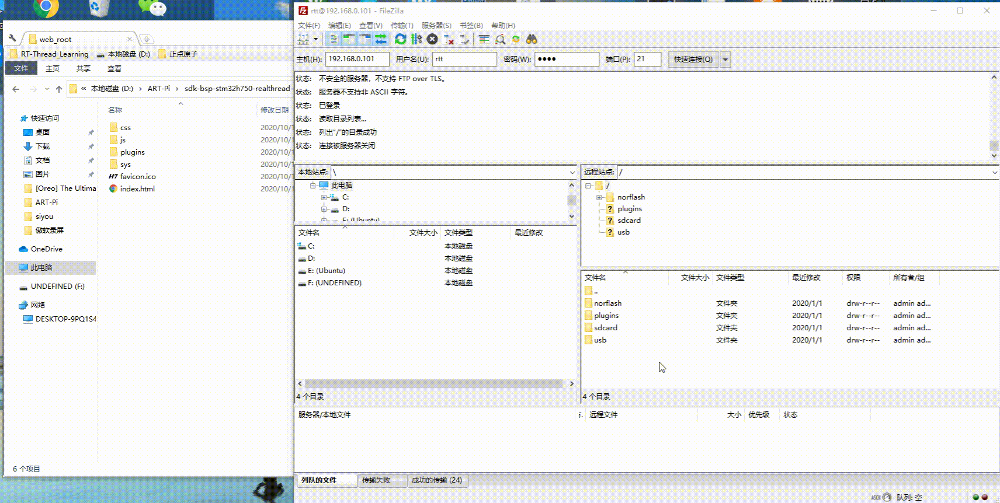
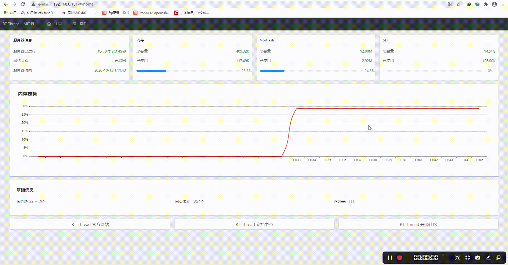

# GATEWAY例程

## 简介

本例程为工业网关综合DEMO，使用动态插件方式扩充功能。内置一个web服务器能够通过网页显示开发板的基本信息及插件信息。同时，内置ftp插件，能够通过ftp客户端(如FileZilla)进行操作。

## 硬件说明

该例程主要使用了核心板和工业扩展版，主要使用了如下资源：

- TF-Card : TF 卡座(可选)
- QSPI FLASH : 8MB 用于存放执行代码
- SPI FLASH : 16MB
- 以太网
- RS232

## 软件说明

本例程应用层代码分为了几个模块：API导出模块，文件操作模块，自动初始化模块，插件管理模块，web服务器模块。源码位于 `modules`目录下。分别为`api_export`,`fs_operation`,`init_module`,`plugins`和`web`。

- API导出模块用于导出内核API给动态模块使用。
- 文件操作模块包括了文件系统的初始化及对文件操作的封装。
- 自动初始化模块用于顺序执行需要的初始化程序。
- 插件管理模块用于管理各个动态插件。
- web服务器模块用于初始化webnet应用。

## 运行

### 编译&下载

编译完成后，将开发板的 ST-Link USB 口与 PC 机连接，然后将固件下载至开发板。

**固件中只带有ftp插件，通过FileZilla连接开发板将扩展功能上传至开发板**:

1. 打开FileZilla，设置最大并发传输为5

2. 连接开发板，端口为21，用户名为rtt，密码为demo

3. 将 `applications/web_root` 下所有的文件上传至开发板的norflash文件夹下

### 运行效果

**支持的扩展插件如下**：

1. ntp : 网络校时，需联网

2. modbustcp2rtu : MODBUS-TCP转MODBUS-RTU(使用的工业扩展版上的RS232接口)，支持3个客户端同时接入

3. 网页显示

## 注意事项

- 该例程是运行在QSPI FLASH中，请先下载bootloader固件
