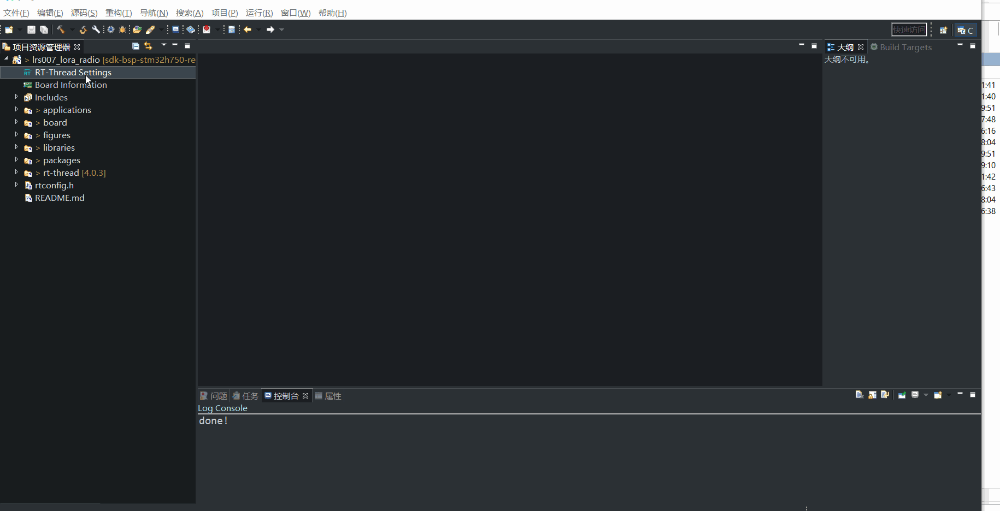

# LoRa-Radio Shell例程

## 简介

LoRa-Radio Shell示例程序主要功能是通过串口shell命令来控制LoRa Radio实现点对点单\双通信、空口抓包等功能。

该例程基于ART-Pi与LoRa多功能扩展板(LRS007)实现，使用了470M LoRa模块(LSD4RF-2R717N40[SX1268])。

[LSD4RF-2R717N40[SX1268]](http://bbs.lierda.com/forum.php?mod=viewthread&tid=87)主要技术参数：

- LoRa芯片：SX1268
- 频段范围：470~510M
- 发射性能：~105mA@ 22dBm(max)
- 接收性能:  ~6mA, -124dBm@SF7&BW125
- 晶振类型：TXCO
- 通信接口：SPI

## 硬件说明

如上图所示，LRS007扩展板的M6位号当前默认贴装470M LoRa模块(LSD4RF-2R717N40[SX1268])，其采用硬件SPI接口(SPI4)与ART-Pi主板连接。

## 软件说明

基于ART-Pi的lora-radio-driver软件包使用参考如下

lora-radio的测试代码采用的是 `/lrs007_lora_radio/art_pi_blink_led/packages/lora_radio_driver-v1.3.0/samples/lora-radio-test-shell ` 。
具体使用方式可参考[《lora-radio-driver软件包使用说明》](https://github.com/Forest-Rain/lora-radio-driver/tree/master/doc)

## 运行
### 编译&下载

编译完成后，将开发板的 ST-Link USB 口与 PC 机连接，然后将固件下载至开发板。

### 运行效果

。

## 注意事项

1. 该示例默认使用了内核的rt_timer来提供定时服务，可根据实际需要，使能multi-rtimer软件包来提供定时\超时服务（STM32平台）。
2. 如果使能ulog进行日志输出，需要开启“Enable ISR log”，为了保证日志输出完整，日志最大长度建议设置≥384

